# Yapay Zeka Öğrenme Yöntemleri

- Danışmalı Öğrenme(Eğiticili)
- Danışmasız Öğrenme(Eğiticisiz)
- Takviyeli Öğrenme(Yarı Danışmalı)
- Çevrimiçi(Sürekli/Dinamik/Online) Eğitim
- Çevrimdışı(Statik/En az bir defa veya birden fazla araklıklı) Eğitim

### Danışmanlı(Eğiticili) Öğrenme

- Modellenen probleme ait örnek gözlemler veri setini kullanır.
- Bağımlı değişken bir sınıf etiketi ya da numeric bir değer olabilir.
- Örnek gözlemler bağımlı veya bağımsız değişkenlerin bilgilerinin olduğu veri setidir.

##### Özet: Problemleme ait örnek durumlar üzerinden öğrenme gerçekleşir.

### Danışmansız(Eğiticisiz) Öğrenme:

- Eğitim süreci yoktur.
- Nesneler öz niteliklerine göre gruplandırılır.
- Bağımlı değişken(sınıf etiketi ve numeric değer) yoktur.

### Takviyeli Öğrenme(Yarı danışmanlı):

- Öğrenme süreci geri bildirimlerle gerçekleşir.
- Cevrimiçi öğrenme şeklinde uygulanır.
- Deneme yanılma yönetimini esas alır.
- Karma eğitim olarakta bilinir.(Hem danışmanlı hemde danışmansız öğrenmeyi içerir).

## Yapay Zeka İle Problem Modelleme Adımları

1. **Problemin Tanımı**

- Problemin tanımı problemimizle tamamen uyumlu olmalı.

2. **Problemin Analizi**

- Bağımlı(varsa) değişken

* Veri türleri

- Bağımsız değişken

* Alabileceği (değerler/etiketler) sınır etiketleri

3. **Tasarım aşaması**

- Algoritma seçimi
- Veri Hazırlama (Veri madenciliğinde tanımlı yöntemlerin tatbik edilmesi)
- Problemin Yapay Zeka algoritmasının geliştirilmesi

4. **Deneysel Çalışma**

- Deneysel çalışma koşullarının/ayarlarının belirlenmesi
- Test aşaması
- Doğrulama Aşaması

### Veri türleri

Sürekli değerli sayısal veriler\
Ayrık değerli sayısal veriler | Algoritma seçiminde dikkate alınması gereken\
Kategorili / Etiketli sınır verileri | hususlardan biri veri türleridir.\
Alfa nümerik tipli(karmaşık) veriler | Bağımlı ve bağımsız değişkenlerin veri türlerinin incelenmesi.

1. Bağımlı değişken yok -> Danışmansız öğrenme uygulanacak -> Kümeleme problemidir | Kümeleme algoritmaları kullanılmalı
2. Bağımı değişken veritürü Sayısal

- Tahmin problemi
- Tahmin algoritmaları kullanılmalı
- Algoritma seçimi için bağımsız değişkenlerin veri türlerini incele Etiketli, Kategorik Ayrık
- Sınıflandırma problemi
- Sınıflandırma algoritmaları kullanılması
- Algoritma seçimi için bağımsız değişken veri türlerine bakılmalı.

3. Karışık tipli veriler

- Bunun için 2 a ve b(ya sayısala yada etiketli) durumuna uyarlama yapılır.

### Tahmin (prediction)

Veriden öğrenen modellerde sistem çıkışının nicel lması durumunda kullanılan yöntemlerin ürettiği değerlerdir.(Danışmanlı öğrenme)

### Sınıflandırma (classification)

Giriş verisine ait çıkışların ntel olduğu durumlarda kullanılan yöntemlerin her veri örneğinin hangi sınıfa ait olduğunu belirlenmesi

### Tahmin ve Kestirme

İstatistikte rasgele bir değişkenin bilinmeyen bir değerinin belirlenmesi için tahmin(prediction),
bilinmeyen bir sabitin belirlenmesi içinse kestirim (estimation) kavramlarından bahsedilir.
Çok yakın anlamları dolayısıyla bu iki terim literatürde çoğunlukla karıştırılarak aynı şeyi ifade etmede kullanılır.

- Tahmin -> değişken
- Kestirim -> parametre ait terimlerdir.

**Sınıflandırma örneğin cevabı**:
1 tane Bağımlı değişken var oda hastanın durumu ama 2 etiket var sağlam ve hasta
2 tane Bağımsız değişkenler X1 ve X2 dir.

### Öğrenme Kuralları

Veriden eğitim için öerilen her algoritma farklı bir öğrenme kuralı olsa da genel eğilim algoritmaları ortak özelliklerine göre gruplamak yönündedir.
Öğrenme algoritmaları dört grupta toplanabilir.

- Hebb
- Hopfield
- Delta
- Kohonen

Danışmanlı veride girdi hatadır. Hatayı düzeltmeye çalışırız.

### Özellik Çıkartımı

Veriye ait olan birçok özellikten bazıları ilgili verinin kümesinin/sınıfının belirlemede önemli rol oynar.

### Veri Hazırlama

Sınıflandırma veya tahmin için problem uzayını tam olarak temsil edebilen veri kümesi hazırlamak gerekmektedir.
Cözüm için hazırlanan veri, hem eğitim hem de başarı ölçümünde kullanıldığı için genellikle ikiye ayrılır.

# Yapay Sinir Ağları (YSA)

Yapay sinir ağlar (YSA) insan beyninden esinlenmiştir.
İnsanın öğrenme sürecinin Matematiksel olarak modellenesi emeline dayanmaktadır.

### YSA Özellikleri

- Doğrusal olmama
- Bilginin saklanması
- Öğrenme
- Görülmemiş örnekler hakkında bilgi üretebilmek
- Eksik bilgi ile çalışabilme
- Örüntü ilişkilendirme ve sınıflama yapabilme
- Genelleme yapabilme
- Uyarlanabilirlik yeteneğine sahip olma
- Hata toleransına sahip olma
- Sadece nümerik bilgiler ile çalışabilme
- Donanım ve hız
- Analiz ve tasarım

### YSA Dezavantajları

- Donanıma bağlı çalışmaları
- Uygun ağ yapısının belirlenmesi
- Ağın parametre değerlerinin (öğrenme katsayısı, her katmandaki hücre sayısı, katman sayısı vb.)
- Ağın sadece nümerik olarak çalışabilmesi
- Ağın eğitilmesinin ne zaman sonlandırılacağı

### Biyolojik Sinir Sistemi

Alıcı sinirler (receptor) organizma içerisinden ya da dış ortamlardan aldıkları uyarıları, beyine bilgi ileten elektiriksel sinyallere dönüştürür.

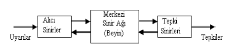

### Biyolojik Sinir Hücresi

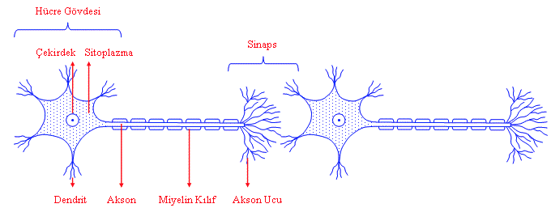

**Dendritler**, sinaptik sinyalleri girdi olarak almakta\
**Hücre gövdesi**, bu sinyali analog bir yöntemle işlemekte\
**Akson**, üretilen denetim sinyalleri aksonlar aracılığı ile denetlenecek hedef hücrelere iletilmektedir.\
**Sinaps** (akson uçları)

#### Bir sinir hücresi, gelen elektrik darbelerinden üç şekilde etkilenir:

- Gelen darbelerden bazısı nöronu uyarır.
- Bazısı bastırır.
- Geri kalanı da değişikliğe yol açar.

### Yapay Hücre Modelleri

Temel bir yapay sinir ağı hücresi biyolojik olarak

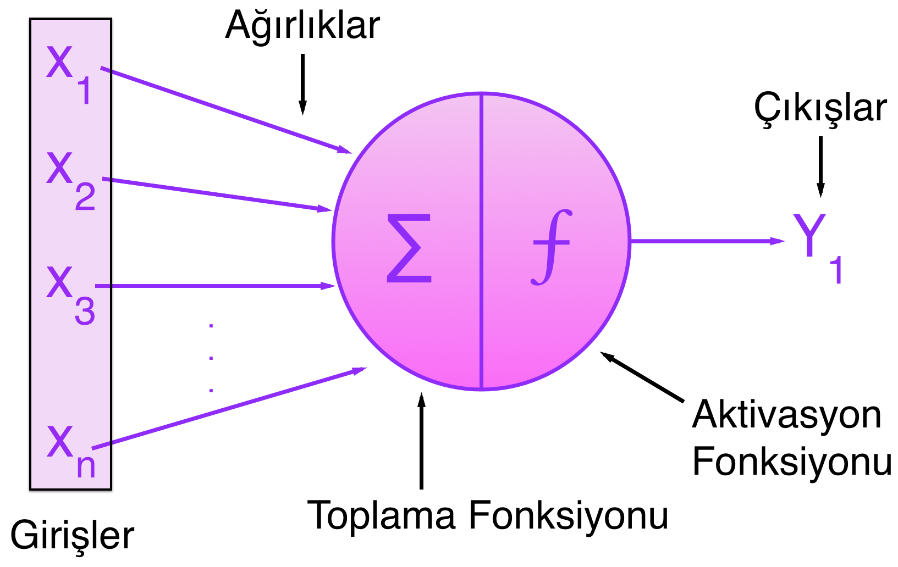

- Girişler
- Ağırlıklar
- Toplama Fonksiyon
- Aktivasyon fonksiyonu
- Çıkışlar bulunur.

**Girdiler**:
Yapay sinir hücresine gelen girişler ağın öğrenmesi istenen örnekler tarafından belirlenir.

**Ağırlıklar**: Ağırlıklar bir yapay hücreye gelen **bilginin önemini** ve **hücre üzerindeki etkisini** gösterir.**Her bir giriş kendine ait bir ağırlığa sahiptir**. Ağırlıklar **pozitif, negatif, sıfır, sabit veya değişken değerler** olabilir. Ağırlıklar **0 - 1 veya -1 - 1** arasında değişir.İlk ağırlıklar **rasgele** olarak yaratılır.

**Toplama**:

**Aktivasyon (Etkinlik) Fonksiyonu**: Bu fonksiyon, hücreye gelen **net girdiyi işleyerek** hücrenin bu girdiye karşılık üreteceği çıktıyı belirler. Genellikle doğrusal olmayan bir fonksiyondur ve toplama fonksiyonunda olduğu gibi ağın hücre elemanlarının hepsi **aynı fonksiyonu kullanması gerekmez**. En çok kullanılan **sigmoid** fonksiyondur.**Türevini** kolay alınabilmesi **eğitim hızını** arttırır.

- **Doğrusal fonksiyon**: Gelen girdiler olduğu gibi hücrenin çıkışı olarak kabul edilir.
- **Step fonksiyon**: Gelen Net girdi değeri belirlenen bir eşik değerinin altında veya üstünde olmasına göre hücrenin çıkışı 1 veya 0 değerini alır.
- **Doyumlu doğrusal fonksiyon**: Gelen bilgileri 0 veya 1' den büyük veya küçük olasına göre 0 ve 1 değerini alır.0 ve 1 arasında ise Net girdi çıkışına gönderilir.
- **Sinus fonksiyonu**: Öğrenilmesi düşünülen olayların sinüs fonksiyonuna uygun dağılım gösterdiği durumlarda kullanılır.
- **Hiperbolik tanjant fonksiyon**: Gelen Net girdi değerini tanjant fonksiyonundan geçirilmesi ile hesaplanır.

**Hücre Çıkışı**: Aktivasyon fonksiyonu tarafından belirlenen çıktı değeridir.Üretilen çıkış dış dünyaya veya bir başka hücreye giriş olarak gönderilir. Hücre kendi çıktısını kendisine girdi olarak da gönderebilir.

#### Oluşturmak için

1. N boyutlu giriş vektörleri
2. N boyutlu ağırlık vektörleri
3. Toplama fonksiyonu bir method yapıcak giriş vektörleri ile ağırlıkları toplayacak
4. Aktivasyon fonksiyonu gerçekleştirilecek

### Perceptron

### Yapay Sinir Ağlarının Yapısı

Yapay sinir hücreleri bir araya gelerek\
**Output layer**: Nöron katmanıdır.\
**Bias**: Öğrenme sürecinde değeri değişebilir veya sabit kalırs.

### MLP Genel Yapay Zeka

Çizgi olarak gösterilenlere ağırlık denir. Çizgiler 0 - 1 veya -1 - 1 arasındadır.1'e çok yakınsa bağlantı ağırlığının çok güçlü olduğunu gösterir. Sıfır'a yakınsa o kadar ağırlıklıkları azdır ve en sonunda 0'a yakın olan işleminler veri settinden çıkartılır. Bağlantı ağırlıkların belirlenmeside algoritma problemidir.

### Çok Katmanlı İleri Beslemeli Ağlar

- Eğer her bir düğüm sonraki katmandaki tüm düğümlerle bağlı ise ağ tam bağlı ağ olarak tanımlanır
- Eğer bağlardan bir kısmı eksik ise bunlara da kısmi bağlı ağlar denir.
- İleri besleme hatayı geriye yaymaktır.

### Öğrenme Stratejileri

- Danışmanlı(Supervised) Öğrenme
- Danışmansız(Unsupervised) Öğrenme
- Takviyeli(Reinforcement) Öğrenme
- Karma Öğrenme

### Danışmanlı (Supervised) Öğrenme (Sınıflandırma)

- Eğitim verileri (gözlemler, ölçüler, vb) gözlem sınıfını belirten etiketleri tanımlar.
- Yeni veriler eğitim kümesine dayanarak sınıflandırılır.
- Sistem, kendisine gösterilen örneklerden genellemeler yaparak problem uzayını temsil eden bir çözüm uzayı üretmektedir.
  - Ağırlıkların konumlarını veri örneklerinden elde ettiği sonuçları üretmiş olduğu hatayı kullanarak ağırlıkların yerini değiştiriyor.
  - Problem uzay: Sistemdeki aramış olduğumuz ağırlıklar problem uzayımızda ağırlıkların sınır değerleridir.
- Veri setinin tüm verilerini uygulandığında 1 epoch olur.
- Çok katmanlı ağın öğrenme kuralı en küçük karaler yönteme dayalı "Delta Öğrenme Kuralı"nın genelleştirilmiş halidir. Bu yüzden "Genelleştirilmiş Delta Kuralı" olarak da isimlendirilir.
- Δwij = 2μxi (beklenen - gerçekleşen)
- Sinapsislerin üzerindeki ağırlık değerinin değişim miktarı delta kuralına göre hesaplanır.
- Bu kuralara göre sinapsisin ağırlıkğındaki değişim, öğrenme oranı (μ) girdi değerleri (xi) sinapsisteki(çıkış) beklenen ve gerçekleşen arasındaki farkı ile çarpımına eşittir.

### Danışmansız (Unsupervised) Öğrenme (Kümeleme)

- Bir grup girdi vektörü sisteme verilir, ancak hedef çıktılar belirtilmez.
- Özdüzenlemeli özellik haritaları bu yöntemi kullanarak sınıflama işlemini yerine getirir.

### Öğrenme Algoritmaları

- Eğitim setinde hata düşüyor doğrulama yükseliyor ise ysa ezberlemiştir
- Belirli epoch sayısınca devam ederse kronik ezberlemeye yapar.
- Referans olarak 83 - 77 6 epoch önce ezbeleme başladı bu yüzden belli sayıda epoch da ezberleme olması gerekli.

**Eğitim**

- YSA'da hücre elemanlarının bağlantılarının ağırlık değerlerinin belirlenmesi işlemine <b>ağın eğitilmesi</b> denir.
- Başlangıçta rastgele alınır.
- Örnekler gösterildikce ağırlıklar yeni değerler alır ve amacına ulaşmaya çalışır.
- Eğer giriş-çıkış ile amaca ulaşılmış ise ağırlık değerleri saklanır.
- Ağırlıkların sürekli değiştiği sürece <b>Öğrenme</b> denir.
- Ağırlık değer değişimi belirli kurallarla yürütülmektedir. Bu kurallara <b>Öğrenme kuralları</b> denir.
- Genellikle örneklerin %80'i ağa verilip ağ eğitilir. Daha sonra geri kalan %20'lik kısım ağın davranışları incelenir ve bu işleme <b>Ağın test edilmesi</b> denir.
- Eğitimde kullanılan örnekler setine <b>Eğitim seti</b>, test için kullanılan sete ise <b>Test seti</b> denir.

### YSA Öğrenme özellikleri ve Hata Fonksiyonu

- Ortalama Mutlak Hata (Mean absolute error, <b>MAE</b>)
- Hataların Karalerinin Ortalaması (Mean squared error, <b>MSE</b>)
- Hataların Karalerinin Toplanmı (Sum squared error, <b>SSE</b>)

**Ortalama Mutlak Yüzde Hata <b>MAPE</b>**
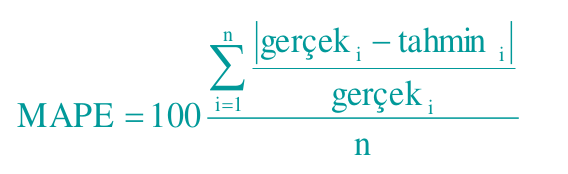

**Hata Fonksiyonları**
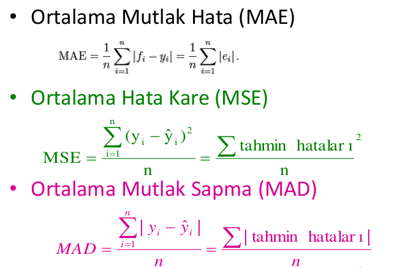

**YSA Öğrenme Özellikleri / Epoch**

- Veri sisteme verilir ve giriş işlemeyi bitirdikten sonra ağırlık ve bias' ın güncellenmesi için başlanılır.
- **Epoch** Tüm giriş verilerinini işlenmesindeki tek bir iterasyon
  - Her epoch'da YSA öğrenir
  - Aynı girişleri çok kere uygulamanın sonucu sistem az bir hata ile eğitilebilir hale gelir
  - Çok sayıda epoch ile sistem tam olarak eğitilmiş kabul edilir.
  - Epoch sistemin kendini eğitim verisine göre eğitebilmesi için gereklidir.

### Öğrenme Parametreleri

**Learning Rate(η)**

- <b>Büyük öğrenme oranı</b>: Sistem veriyi çok hızlı öğrenir, toplam hata artar. Bizi yerel minlerden kurtarır fakat çok büyük sıçramalar yapacağı için komşuluk araması veya ince ayar yapmamızı engeller.
- <b>Düşük öğrenme oranı</b>: Sistem çok yavaş öğrenir, eğitim zamanı artar ancak hata azalır .
- η ile temsil edilir. Genellikle 0,001 - 0,02 arasında değişiyor.
  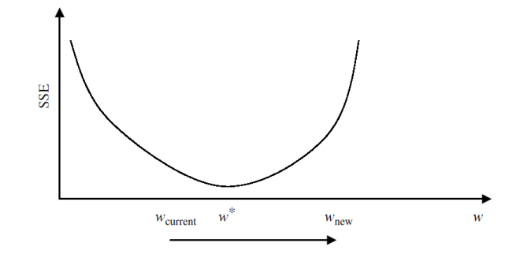

### YSA Çalışma Adımları

- **Örneklerin belirlenmesi** ( Veri uzayını homojen bir şekilde örneklemelidir )
- **Ağın topolojisinin belirlenmesi**
  - Girdi ve çıktı sayısının belirlenmesi
- **Ağın öğrenme parametrelerinin belirlenmesi**
  - Öğrenme katsayısı ve sabitlerin belirlenmesi
- **Ağın başlangıç değerlerinin atanması**
- **Epoch sayısı kadar**
  - Eğitim setindeki tüm örnekler için
    - Örnek ağa gösterilir
    - Hatanın hesaplanması
    - Bulunan hataya göre ağırlıkların güncellenmesi
- **Sistemin toplam hatası hesaplanır**

### Çok Katmanlı Ağın Öğrenme Kuralı
 
 - En küçük karaler yöntemine dayalı "Delta öğrenme kuralının" genelleştirilmiş halidir.
 - Ağın öğrene bilmesi için eğitim setine ihtiyaç vardır. Set içerisinde her örnek için hem girdi hemde çıktılar belirlenmiştir.
 - **2 Aşamadan oluşur**
    - İleri doğru hesaplama ( **Feed Forward** )
    - Geri doğru hesaplama ( **Back Propogation** )

#### İleri Doğru Hesaplama
  - Eğitim setindeki 1 örneğin Girdi Katmanından ağa gösterimesi ile başlar
  - Gelen girdiler hiçbir değişiklik olamadan ara katman gönderilir.
  - Girdi katmanı **Gk**
  - İşlem elemanının çıktısı **Çki**
  - Çki = Gk

  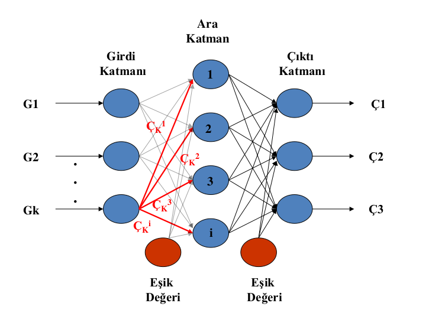
  
  - Ara katmandaki her işlem elemanı girdi katmanındaki bütün işlem elemanlarından gelen bilgileri bağlantı ağırlıklarının (A1,A2,....) etkisi ile alır. Önce ara katmandaki işlem elemenlarına gelen net girdi **(Netja)** şu formül kullanılarak hesaplanır.

  
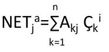

  
  - Burda Akj k. girdi elemanı j. ara katman elemanına bağlayan bağlantının ağırlık değerini göstermektedir. J. ara katman elemanının çıktısı ise bu net girdinin aktivasyon fonksiyonundan geçirilmesiyle hesaplanır

  
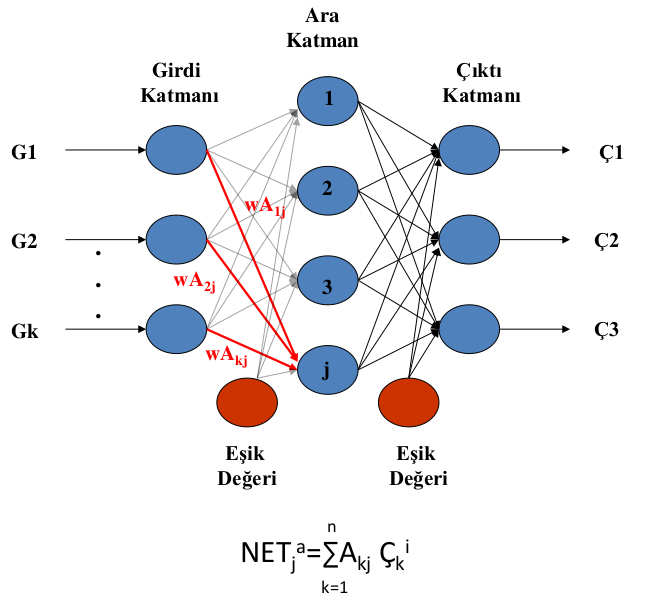

  - Bir sigmoid fonksiyonun kullanılması halinde
  
  
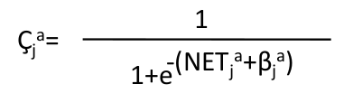

  - Burada βj , ara katmanda bulunan j. elemana bağlanan eşik değer elemanının ağırlığını göstermektedir. Bu eşik değer ünitesinin çıktısı sabit olup 1’e eşittir. Eğitim sırasında ağ bu değeri kendisi belirlemektedir.

  
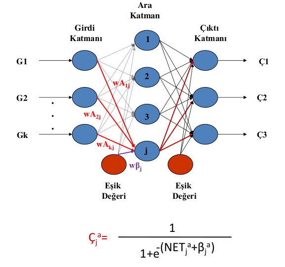

 #### Geri Doğru Hesaplama
  - Ağa sunulan girdi için ağın ürettiği çıktı ağın beklenen çıktıları ile karşılaştırılır. Bunların arasındaki fark hata olarak kabul edilir. Amaç bu hatanın düşürülmesidir.
  - Bu hata, ağın ağırlık değerlerine dağıtılarak bir sonraki iterasyonda hatanın azaltılması sağlanır. Çıktı katmanındaki m. işlem elemanı için oluşan hata Em ;

  **
Em = Bm - Çm
**

  - Yukarıdaki hata, bir işlem elemanı için oluşan hatadır. Çıktı katmanı için oluşan toplam hatayı (TH) bulmak için bütün hataların toplanması gerekir.
  
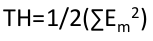

  - Ağın ağırlıklarını değiştirmek için **2** durum vardır.
    - **Ara katman** ile **çıktı** katmanı arasındaki ağırlıkların değiştirilmesi
    - **Ara katmanlar arası** veya **ara katman gird**i katmanı arasındaki ağırlıkların değiştirilmesi.

#### Ara Katman İle Çıktı Katmanı Arasındaki Ağırlıkların Değiştirilmesi
  - Ara katmandaki j. işlem elemanı çıktı katmanındaki m. işlem elemanına bağlayan bağlantının ağırlığındaki değişim miktarı **ΔAa** denirse; herhangi bir t zamanında ağırlığın değişimi şöyle hesaplanır:
  
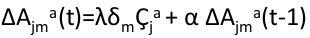

  - Burda **λ** öğrenme katsayısı **α** momentum katsayısını göstermektedir.
  - **δm** ise m. çıktı ünitesinin hatasını göstermektedir.
  - Momentum katsayısı ağın öğrenmesi esnasında yerel bir optimum noktaya takılıp kalmaması için ağırlık değişim değerinin belirli bir oranda bir sonraki değişime eklenmesini sağlar. j. işlem elemanı çıktı katmanındaki m. işlem elemanına bağlayan **bağlantının ağırlığındaki değişim miktarının hesabı**:
  

  - Yine yukarıdaki formül dikkate alındığında δ m ise m. çıktı ünitesinin hatasını göstermektedir.

  
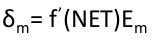

  - f ’ (NET) aktivasyon fonksiyonunun türevidir. Sigmoid fonksiyonun kullanılması durumunda m. çıktı ünitesinin hatası:

  
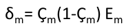

  - Değişim miktarı hesaplandıktan sonra ağırlıkların t. iterasyondaki yeni değerleri (j. işlem elemanı ile m. işlem elemanını bağlayan bağlantının güncel değeri )

  
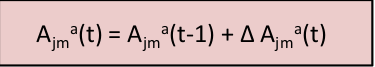
